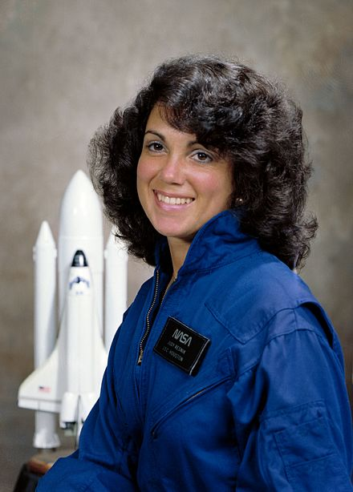

## Intro
This is part 1 of a [3 part series](/posts) where I talk about theatre engineering for the play [You're Too Cute to Be An Astronaut](https://www.cuteastronaut.com/). In this part you can find out about the motivation for the play and its audio design.

## What does it feel like to leave earth?
One of my very first memories is from 1984. It's spring time, and me and my family are celebrating my fourth birthday. Our garden is filled with relatives and friends. But I'm not there. I'm in the living room, next to the record player. I'm flat on my back in my dads recliner, wearing brown AKG headphones. I have just been gifted a vinyl record called "A True Space Adventure: Space Shuttle" and I need to find out what it sounds like, right now.

The record starts with a narrator describing the preparations of STS-1, the first Space Shuttle mission in 1981. As the Launch Director counts down, 3...2...1... I close my eyes and at T-0, when the solid rocket boosters ignite, I am right there. I'm part of the crew of Space Shuttle Columbia. It was the most exciting thing I had ever felt. And I've been a space-nerd ever since.

## A Brilliant Astronaut
My partner [Judy](https://www.imdb.com/name/nm5337715), is an actress by profession. In May 2022 she was watching the Netflix series [Challenger: The Final Flight](https://www.netflix.com/title/81012137) documenting the first Space Shuttle that was lost, including its crew of 7. The documentary focuses on mission STS-51-L, which gained a lot of attention since it would be flying payload specialist and 'Teacher in Space' [Christa McAuliffe](https://en.wikipedia.org/wiki/Christa_McAuliffe). She would be the first teacher to teach two classes from space.

But Judy was way more interested in astronaut [Judy Resnik](https://en.wikipedia.org/wiki/Judith_Resnik). Owner of a PHD in Electrical Engineering, software developer of Space Shuttle's Canadarm, classical pianist and only interested in "doing the work". She was undeniably brilliant and had a great sense of humour. But since she was single, it was difficult for the producers of the documentary to find personal information about her. Resnik became somewhat of an enigma and while watching the documentary, (my) Judy sent me a picture of Resnik, and informed me: "From now on, I'm lying to people that I'm named after her".

Before Resnik flew the fatal Challenger mission, she flew mission STS-41-D on board of Space Shuttle Discovery and became the second American Woman in Space. And the first Jewish American in space. After doing some research I think it is fair to say that Judy did note give a single crap about those titles, nor did she care for the media attention that they attracted. There is something truly powerful about how she handles the following interview and I think it speaks for itself.



## You're Too Cute To Be An Astronaut
Inspired by Resnik, and after a year of research and writing, Judy, the actress, turned out to also be a playwright. She completed the theatre screenplay for [You're Too Cute To Be An Astronaut](https://www.cuteastronaut.com/). The play surfaces the systemic sexism against women, especially engineers, and how absurd and insignificant it looks against the backdrop of their achievements. She's been on stage inspiring her audience with an incredibly ambitious message and I could not be more proud of what she's achieved. Our society desperately needs more women engineers, and creative ways of inspiring young women to do so. By times it is also hilarious, so I think even Resnik would approve.

## Recreating a Shuttle Launch
One act of the play involves the launch of Space Shuttle Mission STS-51-L. I was asked to help with the theatre engineering of the play. Our mission for this act, was to use audio and visuals in such way, that we would bring the audience along for the ride. Transcend their role as spectators, and have them right there with the crew as they left the platform. Just as I had experienced as a kid on my dads recliner.

### NASA Archives
Thanks to the amazing work of Nasa's John Stoll, a lot of the audio from that fateful morning on January 28, 1986 is available on [Archive.org](https://archive.org/details/STS-51L). 

I have been able to distill the following voice loops from there:
* Public loop - Kennedy Space Center
* Public loop - Mission Control Center
* Air to Ground Loop
* Flight Director loop

> If you want to know more about how voice loop systems work, read [this](https://www.interruptions.net/literature/Patterson-CSCW-JCC99.pdf)

A LOT of cleaning up had to be done. There is hours and hours of audio there, but it is hard to find the good stuff. I extracted one particular audio channel by reversing the left channel and suddenly I had the flight director loop, which I thought did not exist before. I cleaned up the audio channels by choosing the best parts out of the files, then applied [EQ](https://www.tokyodawn.net/tdr-nova/) and a [denoiser](https://bertomaudio.com/denoiser-classic.html).

But to truly get the feeling of being there, you need audio from on board of the Space Shuttle. The sound of the Operational Recorder of the Challenger disaster has not been publicly [released](https://www.justice.gov/oip/blog/foia-update-space-shuttle-privacy-appeal-decided). The only thing available is a [transcript](https://history.nasa.gov/transcript.html). I needed to find another way to find out what that day sounded like from within the shuttle.
> T+15..............MS 2..... (Expletive) hot.
— <cite>(Judy Resnik)</cite>

### Riding the Booster
Luckily NASA obsesses with recording all their launches for safety purposes. The DVD [Special Edition Ascent: Commemorating Space Shuttle](https://www.youtube.com/watch?v=W2VygftZSCs) is as stunning visually as it is educational. As part of the Special Edition, the team at NASA used audio from microphones mounted on the boosters of STS-117 and STS-127 missions and sent it over to Lucasfilm  [Skywalker Ranch](https://www.lucasfilm.com/campuses/skywalker-ranch/) where it was mastered and made to sound exceptionally well as part of their [Riding the Booster](https://www.youtube.com/watch?v=527fb3-UZGo&t=9s) bonus material.

### Bringing it all together
All the materials were brought into Garageband, where I time-synced and mixed everything together, to create (to the best of my knowledge) the best sounding audio of the Challenger launch. Sit down in your favorite recliner, put on your headphones,  close your eyes and enjoy!



## See: You're Too Cute To Be An Astronaut
For tickets or bookings go to [cuteastronaut.com](https://www.cuteastronaut.com/)
> Astronauts don’t have to be either very feminine or very masculine women or very superhuman males, or any color or anything. It’s about people in space. 
> — <cite>Judy Resnik</cite>

## Continue reading
In [Part 2](/posts/cute-astronaut2/) of this series, you can learn how I created a show controller for the play using Home Assistant.