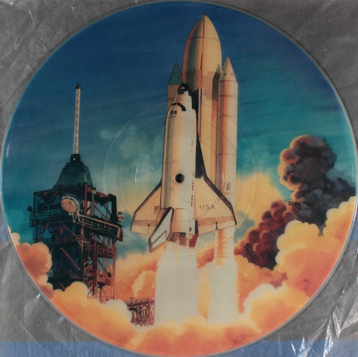

One of my very first memories is my fourth birthday. The garden is filled with family and friends, but not me; I'm inside, laying horizontaly in my dads recliner, wearing headphones. I was just gifted a vinyl record: "A True Space Adventure: Space Shuttle". I needed to find out what it was. The record started with a narrator describing the preparations of the first Space Shuttle Mission, or STS-1 in 1981. As the Launch Director counts down, I close my eyes and at T-0, when the solid rocket boosters ignite, I am right there as part of the crew on Columbia. It was the most exciting thing I have ever heard, And I have been a space-nerd ever since.

