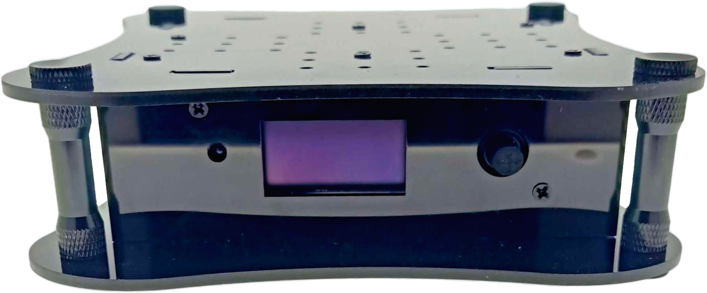
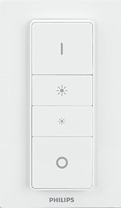
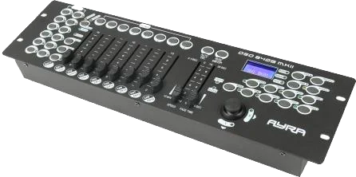
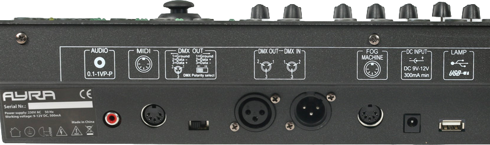
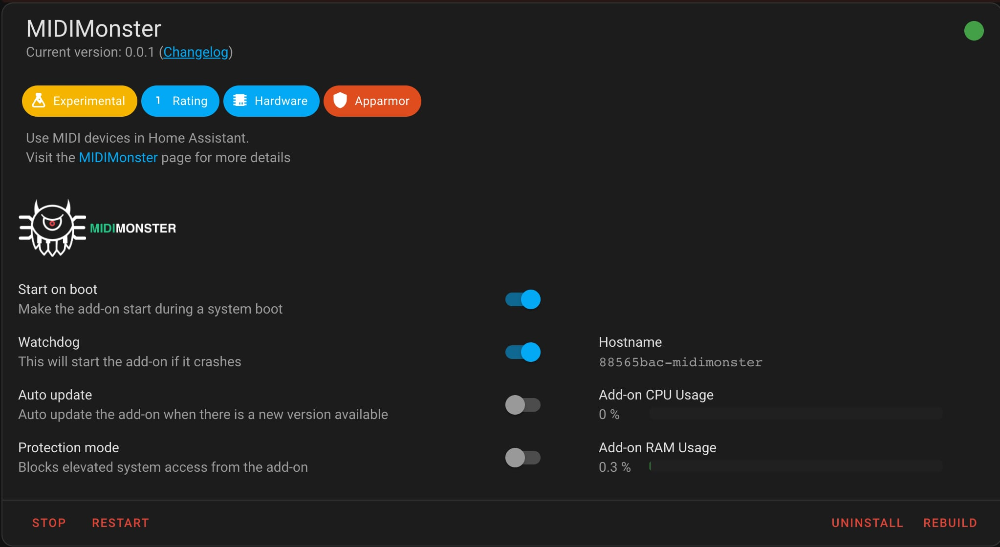
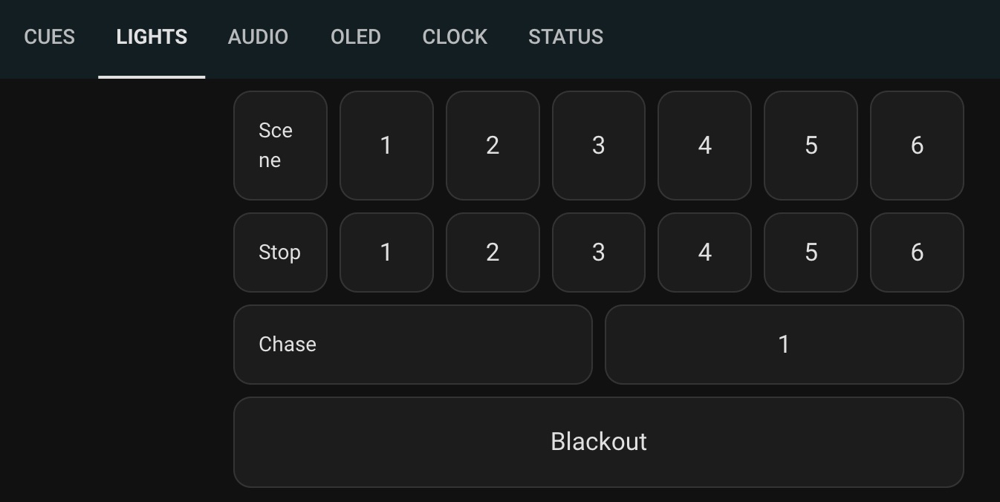
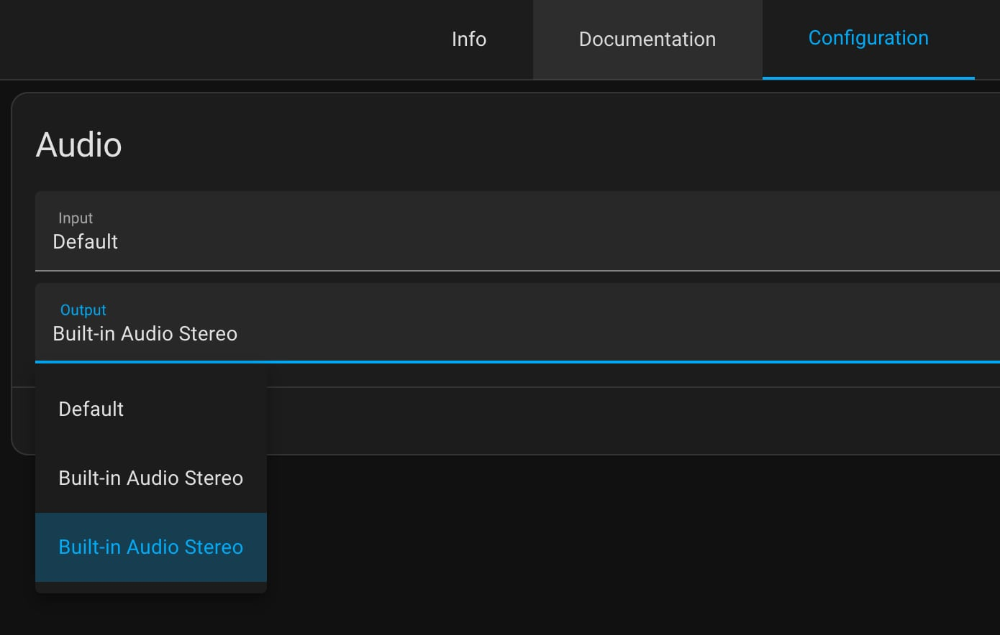
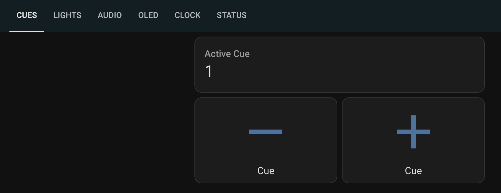
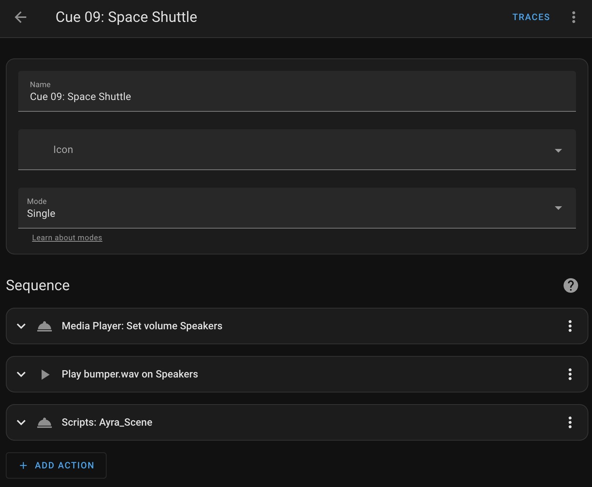
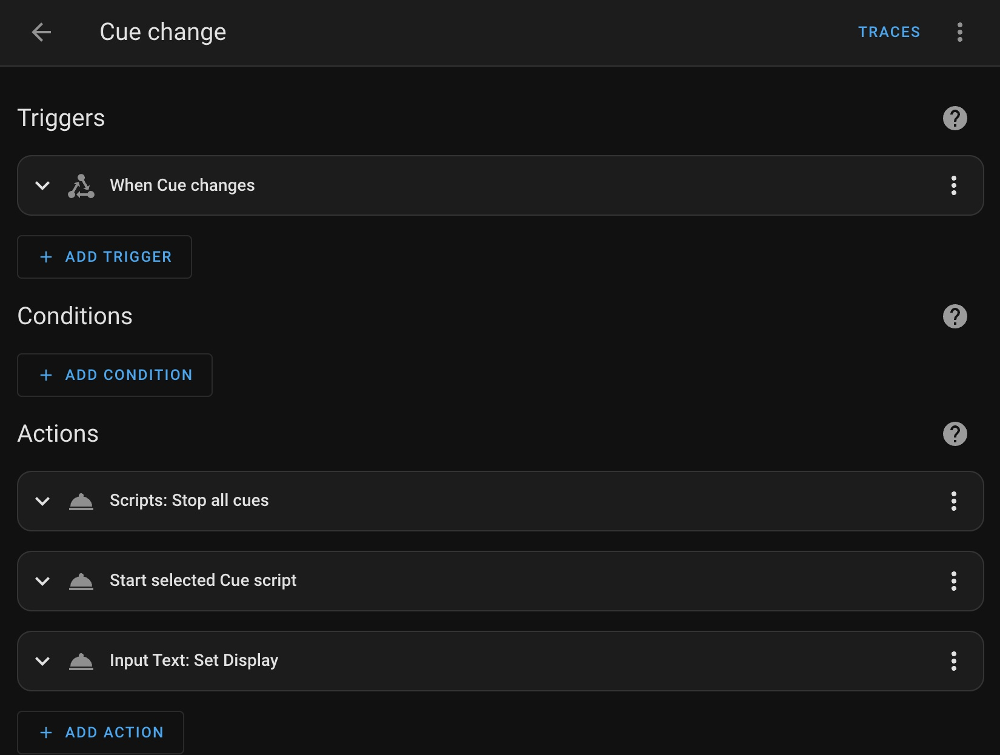

## Intro
This is part 2 of a [3 part series](/posts) where I talk about theatre engineering for the play [You're Too Cute to Be An Astronaut](https://www.cuteastronaut.com/). In [part 1](/posts/cute-astronaut/) of this series you can find out about the motivation for the play and its audio design. This part will focus on creating a show controller for the play using Home Assistant.

## Flying Solo
One of the constraints for the venue for the play, was that our actor, Judy needed to perform solo, without any outside help. There would be no theatrical tech in the room where the play would be performed.

Other actors performing at this venue cope with this by using their phone to trigger audio cues and press buttons on a light controller by hand **while also performing**. We both felt we could do better. I mean, we have the technology right?

## Home Assistant to the rescue
When I need something automated in our house, I use [Home Assistant](https://www.home-assistant.io/). So, when tasked with the challenge of automating a play, this is the first tool I thought of. I'm aware there is powerful software available like [QLab](https://qlab.app/), but I really like the ability of leveraging the integrations Home Assistant comes with.

I had an [Allo Boss 2](https://allo.com/sparky/boss2.html) laying around, which makes an (almost) perfect platform for a theatre control system:
* Small from factor
* [Raspberry Pi 4](https://www.raspberrypi.com/products/raspberry-pi-4-model-b/) based, so it runs Home Assistant
* [High Quality Audio output](https://www.audiosciencereview.com/forum/index.php?threads/allo-boss2-review-stereo-streamer.22916/)
* 132 x 64 OLED Screen
* IR remote control

> Although this system runs amazing, the acrylic case is quite fragile. If you go the same route, I'd recommend going for the [Allo Boss 2 Player](https://allo.com/sparky/boss2-player.html), which has an aluminum case.

Installing Home Assistant on the Allo Boss 2 is a breeze, just follow the [Raspberry Pi Guide](https://www.home-assistant.io/installation/raspberrypi).

## Remote control
I wanted to give our actress a small remote which would be reliable, easy to use, and has multiple buttons for additional control. I chose the [Philips Hue Dimmer](https://www.zigbee2mqtt.io/devices/324131092621.html) which is supported by the [Zigbee2MQTT](https://github.com/zigbee2mqtt/hassio-zigbee2mqtt#installation) add-on. I chose the CC2652P based [SONOFF Zigbee Dongle](https://itead.cc/product/sonoff-zigbee-3-0-usb-dongle-plus/) which is compatible with the [Z-Stack-firmware](https://github.com/Koenkk/Z-Stack-firmware).

Z-stack and Zigbee2MQTT is a solid combination, but since the [Home Assistant SkyConnect](https://www.home-assistant.io/skyconnect/) is now generally available, I would recommend you go with that. It's smaller, can do Thread and Zigbee at the same time, and it works great with [ZHA](https://www.home-assistant.io/integrations/zha/).

## Lights
The venue we'd be playing in had a few DMX lights and simple [Ayra light controller](https://www.bax-shop.nl/dmx-lichtsturingen/ayra-oso-240b-mkii-dmx-lichtsturing). I wanted to have the light scenes programmed in this controller and be able to trigger the scenes from home assistant.

Let's have a look at the connectivity options on this device:

According to the manual:
* DMX-In: "For File Dump data exchange only". Off to a great start.
* USB: "Not suitable for any kinds of data transmission!". Wow, nice.
* MIDI: "for external MIDI signals". That looks promising!

Actually, MIDI is the only way to trigger anything on this controller. There is a table in the manual that maps MIDI notes to functions inside the controller. It lists "MIDI NOTE 00 to 07, Scenes 1-8 in BANK 1" sounds simple enough!

I bought a [MidiMate EX](https://www.esi-audio.com/products/midimateex/) USB to MIDI cable and we're off to the races. Except that Home Assistant has no MIDI support.

To make Home Assistant support MIDI, I created the [MIDIMonster Add-on](https://github.com/wildekek/ha-addons/tree/main/midimonster).

Currently it supports MQTT and MIDI, but it can easily be extended to support other [backends](https://kb.midimonster.net/general/Backends.html) like ArtNet or OSC. I can now fire an MQTT event and as a result, the Ayra light controller switches scenes!

## Sound
Since the play has a few music tracks, as well as a [Space Shuttle launch](https://www.youtube.com/watch?v=0CTTGTS5IEA), I wanted to make sure I used the Allo Boss' high quality DAC. To enable it, you'll have to load a kernel overlay. Unfortunately there is no feature in Home Assistant natively to do this, and it has to be done by editing a file on the root file system. I can recommend adding [Adam Outler's add-on repository](https://github.com/adamoutler/HassOSConfigurator): it has an SSH add-on that allows you to log in directly to the host OS. Then, load the right overlay by adding it to /mnt/boot/config.txt:

	[ALL]
	dtoverlay=allo-boss2-dac-audio

To play audio locally, you can use the [VLC Add-on](https://github.com/home-assistant/addons/tree/master/vlc) which is available in Home Assistant natively. You should now have two "Built-in Audio Stereo" devices, and the second one should be your All Boss DAC. You can use it as a [media player](https://www.home-assistant.io/integrations/media_player/) and play sound files.

> Caveat: Although VLC works great for most applications, I did have some issues with intermittent playback of short (<1s)> audio effects.

## Cue!
Now that we have our remote working and we can trigger light and sound, we need a cue system to tie it all together. Home Assistant has a [counter helper](https://www.home-assistant.io/integrations/counter/) that is excellent for tracking which cue we're on. An automation then listens for button presses on the remote, and increments and decrements the cue counter. I also added a dashboard in Home Assistant to control them:

I also wanted to show the active cue on the OLED display built in to the Allo Boss 2. To do that I created an [OLED add-on](https://github.com/wildekek/ha-addons/tree/main/oled). Now our actress can see which cue she selected.


To make the cue change actually do things, I created a script per cue that does what we want. For example:
1. Set the volume of our audio output to the right level
2. Play a bumper sound
3. Set the light to a specific scene

To trigger these cues an automation listens for changes to the cue, and:
1. Stops any running cue scripts
2. Trigger the selected cue script
3. Show the cue on the OLED display

## Conclusion
I'm really happy with the way this turned out. It is easy to read and reason about what a cue does, even for a non-technical person. It also makes it super easy to change the order of things or change their parameters. And while I'm writing this it has has worked flawlessly for more than 40 live performances.

## See: You're Too Cute To Be An Astronaut
For tickets or bookings go to [cuteastronaut.com](https://www.cuteastronaut.com/)
> Astronauts don’t have to be either very feminine or very masculine women or very superhuman males, or any color or anything. It’s about people in space. 
> — <cite>Judy Resnik</cite>

## Continue reading
In [part 3 of this series](/posts/cute-astronaut3/), I talk about hacking a 7-segment clock to be used a launch countdown clock for the performance.
