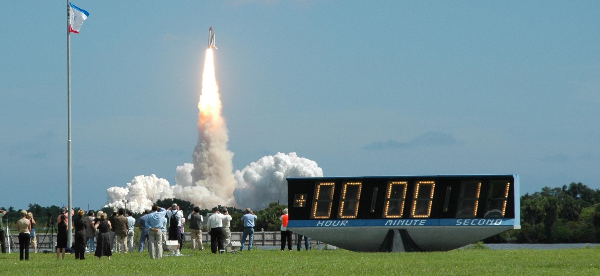
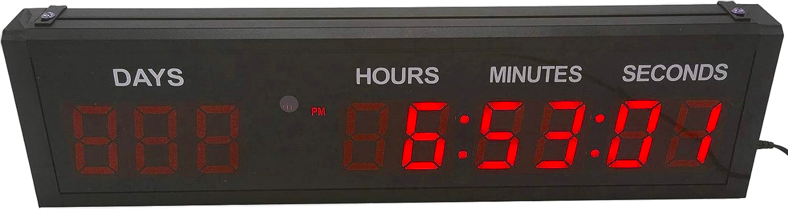
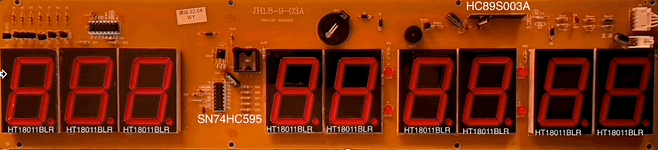
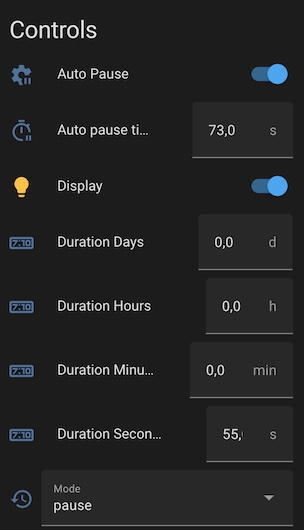
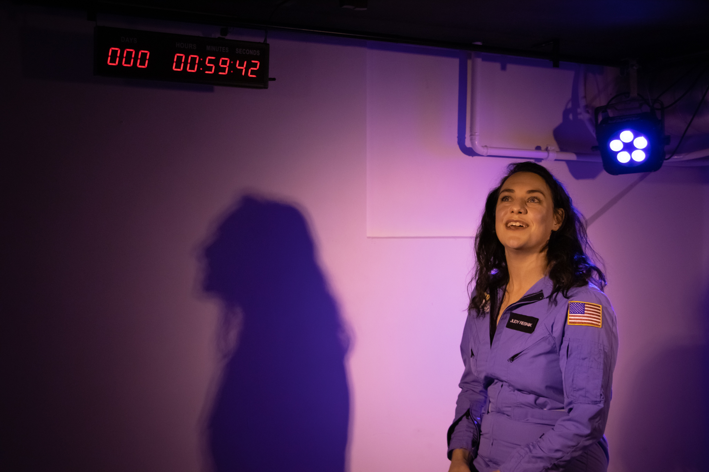

## Intro
This is the final piece of a [3 part series](/posts) where I talk about theatre engineering for the play [You're Too Cute to Be An Astronaut](https://www.cuteastronaut.com/). In [the first part](/posts/cute-astronaut/) of this series you can find out about the motivation for the play and its audio design. The [second part](/posts/cute-astronaut/) explains how I used Home Assistant to function as a show controller for the play.
In this post I show how I created a remote controlled countdown clock using [ESPHome](https://esphome.io/).

## 5... 4.. 3... 2... 1...
Whilst [Judy](https://www.linkedin.com/in/judylijdsman/) was creating the play, she wanted to have a scene that revolved around the launch of the Space Shuttle. Discussing how to convey the tension that comes with a rocket launch in a theatre, we both felt that a physical countdown clock would be a must-have. The combination of the low rumble of the engines starting up, Mission Control counting down whilst having a real clock doing the same, becomes more than the sum of its parts.

## NASA's Countdown Clock at Kennedy Space Center
During the Shuttle era, everyone viewing a launch at the Kennedy Space Center’s Press Site, or watching from TV at home would see the iconic Countdown Clock. It's a [7 segment display](https://en.wikipedia.org/wiki/Seven-segment_display), an old but still popular display technique, which works by lighting up 7 individual segments to form a digit.

Since 2014 NASA replaced their Countdown Clock at the press site with a more [modern LED display](https://en.wikipedia.org/wiki/Launch_Complex_39_Press_Site). Personally, I feel that it lost its charm. Luckily NASA restored the old clock and it is now [permanently on display](https://youtu.be/z6MlHg5avsg?t=44) at the Kennedy Space Center Visitor Complex.

## Making our own clock
We both really liked the vintage look of a 7-segment display, so we started looking on [AliExpress](https://www.aliexpress.com/item/32955610923.html) and found this clock for only €64,-. Quite the steal!

This clock is the perfect size and has those nostalgic 7-segment displays we were looking for. Bonus, it looked like one of these 80's alarm clocks, which is the same era the play is set in. However it had two problems that needed to be solved:

**Remote Control**
The clock comes with an infrared remote. We wanted to hook it up to [Home Assistant](/posts/cute-astronaut/), so Judy can make the clock do what she wants with a single click of her remote. I tried using a [Broadlink IR transmitter](https://www.amazon.com/Broadlink-RM4-Universal-Control-Compatible/dp/B07ZSF46BX) to send infrared commands, but it was both slow and unreliable. To make sure I had maximum control over the clock I decided to convert it to [ESPHome](https://esphome.io/). For this to happen, I needed to desolder the MCU in the clock and replace it with an [ESP32](https://a.co/d/bOQfCtY).

I opened up the clock to replace the MCU with the ESP32. A quick tip if you want to reverse-engineer a circuit board: take high resolution photos of the front- and back of the board and use your favorite image editor and a mask. This way you can quickly see how the traces run.

After soldering the ESP32 to the board, I [wrote code](https://github.com/wildekek/countdown-clock) to make it do what we needed for the play over WiFi:

**Contrast**
As you see the clock looked a bit "dim" and you can clearly see the unlit segments in the background. To solve this, I placed the segments closer to the front panel and used the brightness control in my code to create more contrast between the lit and unlit segments.

## See it in action
[You're Too Cute to Be An Astronaut](https://www.cuteastronaut.com/) is playing 3 more times this August in Amsterdam. Go see it!

## Addendum - A delicate dance
If you're interested in what it takes for the Space Shuttle to launch, this video by Scott Manley does an amazing job:
