## 🍃 Uitgangssituatie
Zonne- en windenergie zijn de goedkoopste bronnen van energie ooit. Niet in de toekomst, maar al sinds 2019[¹](#bronvermelding). In de afgelopen 10 jaar zijn de kosten van “Solar en Wind” gedaald met 82%, en alles wijst er op dat de komende 10 jaar de prijzen nogmaals diezelfde daling in kosten gaan laten zien[²](https://www.notion.so/Solar-en-Wind-op-Aruba-d215650fc700413ea244c7028a3a4de2?pvs=21). De kosten van de **aanschaf** van Solar en Wind, zijn nu al goedkoper dan de **operationele** kosten van een gas of olie installatie[³](#bronvermelding).

> 🛢️ Vandaag de dag wordt voor het opwekken van energie op Aruba nog steeds voor meer dan [80% met stookolie](https://app.electricitymaps.com/zone/AW) (HFO) gedaan. Er is begonnen om de installaties geschikt te maken [om meer met gas te stoken](https://antilliaansdagblad.com/aruba/27189-aruba-regionaal-leider-schone-energie).

Gezien de ligging van Aruba, het aantal uren zon, en de stevige wind is het haast vanzelfsprekend om zo snel mogelijk te investeren in Solar en Wind.

---

## ⏩ Procedure aanvragen solar

Het aanvragen, installeren en in gebruik nemen van een solar installatie bestaat uit een aantal stappen. Zie hieronder een diagram met alle stappen die genomen moeten worden[⁴](https://www.notion.so/Solar-en-Wind-op-Aruba-d215650fc700413ea244c7028a3a4de2?pvs=21).

```mermaid
flowchart TD
    classDef default stroke:#1C3829,stroke-width:1px;
    classDef elmar fill:#2572D0
    classDef solar fill:#1FA08E
    classDef installateur fill:#AC0CC6
    waiver[Solar Waiver]:::elmar --> |2 weken| prelim[Preliminary approval]:::elmar
    prelim --> |1 week| site[Site inspectie]:::solar
    site --> |1 week| offer[Offertes]:::solar
        offer --> offer_signed[Tekenen offerte]:::solar
        offer_signed -->|12-20 weken| oplevering[Oplevering]:::solar
    site -. Ongekeurde installatie? .-> opwaarderen
    subgraph opwaarderen[Opwaarderen installatie]
        inspection[Inspectie]:::installateur --> herstel[Herstel]:::installateur
        herstel --> tekening[Tekening]:::installateur
        tekening --> keuring[Keuring]:::elmar
    end
    opwaarderen --> oplevering
    oplevering[Oplevering]:::solar --> |24-52 weken| eindinspectie[Eindinspectie]:::elmar
    eindinspectie --> interconnection[DG Interconnection Agreement]:::elmar
    interconnection --> teruglevering["✅ Teruglevering energie"]:::elmar
```

---

## 🔌 Energievoorziening

[Elmar](https://www.elmar.aw/) is de enige energieleverancier op het eiland en ook verantwoordelijk voor de elektrische infrastructuur.

### Toestemming

Alvorens je zelf energie kunt opwekken moet je een [Waiver Solar Installation](https://www.elmar.aw/sites/default/files/pdf-files/Solar%20Waiver%20Feb.%2023%202017.pdf) invullen, opsturen naar [solar@elmar.aw](mailto:solar@elmar.aw) en wachten op toestemming. Er is kans dat je op een wachtlijst komt en niet direct toestemming krijgt.

### Keuring

Om een solar installatie te kunnen krijgen moet je eerst een volledig gekeurde elektrische installatie hebben. Deze moet voorzien zijn van recente tekeningen, een goedkeuringsstempel en handtekeningen van de inspecteur van Elmar en DTI[⁶](#bronvermelding).

Indien je de benodigde papieren niet hebt dan moet je een afspraak maken met een keurmeester uit de lijst van keurmeesters van Elmar[⁷](#bronvermelding). Je krijgt vervolgens een offerte voor het aanpassen van de installatie naar de huidige wetgeving, en zal er een herkeuring plaats vinden.

### Pre-paid meter

Bij gebruik van een pre-paid meter kan er geen solar installatie aangelegd worden.[⁴](#bronvermelding)

### Slimme meters

Elmar is bezig met het uitrollen van slimme energiemeters[⁸](#bronvermelding), die op afstand worden uitgelezen. Hierdoor wordt het makkelijker inzicht te krijgen in opbrengst en verbruik.

> “Aruba wants to provide all houses with a smart meter by the end of 2024. Half of all customers of energy supplier ELMAR already have a smart meter.” -- <cite>Audrey Croes, Elmar</cite>
> 

---

## **⬛ Hoeveel zonnepanelen moet ik nemen?**

### **Uitleg Piekvermogen (Wp)**

Het vermogen van een zonnepaneel wordt uitgedrukt in Watt Peak of Wp. Voor elk paneel kun je deze waarde terugvinden in het datasheet van de fabrikant ([voorbeeld](https://static.trinasolar.com/sites/default/files/MA_Datasheet_TallmaxM_DE17M(II)_2020C.pdf)). Dit is het maximaal vermogen wat je van een paneel kunt verwachten in ideale omstandigheden. Je zult dit alleen bereiken op een koele, maar zonnige dag. Dit omdat zonnepanelen als ze warm worden minder efficient werken.

### Hoeveel panelen mag ik?

> 👮‍♀️ Elmar heeft in zijn [Solar Policy](https://www.elmar.aw/sites/default/files/pdf-files/N.V.%20ELMAR%20Solar%20Policy%20English%20Aug%202022%20ver%203.5.pdf) een restrictie opgenomen dat je als huishouden niet meer dan 10.000Wp (= 10KWp of Kilowatt Peak ) aan mag sluiten.

Een modern zonnepaneel heeft al snel 455Wp, wat betekent dat je niet meer dan (10.000Wp/455Wp)≈ **max 21 zonnepanelen** aan mag sluiten op je installatie. Zo’n installatie geeft per maand [ongeveer 1500 KWh aan energie](https://globalsolaratlas.info/detail?s=12.531104,-70.027542&m=site&c=12.556574,-70.015526,11&pv=small,180,14,10), meer dan voldoende om de volgende apparaten van energie te voorzien:

- 3-4 airco’s (inverter type)
- Wasmachine en Droger
- Waterboiler 100-200 liter
- Zwembad installatie met inverter pomp
- Een elektrische oven en inductiekookplaat

Dan nog houd je bij redelijk gebruik genoeg over om een elektrische auto te laden. 

---

## 🔌 Inverters

Simpel gezegd zorgen inverters (omvormers) er voor dat de gelijkspanning welk uit de zonnepanelen komt, wordt omgezet in wisselspanning voor in huis en het stroomnet.

Er zijn 3 types inverters, elk met voor- en nadelen.

|  | String Inverter zonder optimizers | String inverter met optimizers | Micro Inverter | Opmerkingen |
| --- | --- | --- | --- | --- |
| Kosten installatie | 💰💰 | 💰💰💰 | 💰💰💰 | Indien je optimizers of micro inverters wilt, dan zijn dit extra onderdelen die de aanschaf duurder maken. |
| Kosten meterkast | 💰 | 💰 |  | Door de hogere spanning van string inverters moet de meterkast beveiligd worden met sloten. |
| Opbrengst bij Meerdere daken | ⭐ | ⭐⭐ | ⭐⭐⭐ | Als je solar over meerdere daken wilt leggen dan is een string inverter geen goede keuze. |
| Opbrengst bij gedeeltelijke schaduw | ⭐ | ⭐⭐⭐ | ⭐⭐⭐ | Als de panelen door bomen of wolken gedeeltelijke schaduw krijgen, worden de panelen minder effectief. |
| Monitoring en foutdetectie | ⭐ | ⭐⭐⭐ | ⭐⭐⭐ | Dit maakt het makkelijk om per paneel de opbrengst te zien en een defect paneel te vervangen |
| Uitbreiding in toekomst | ⭐ | ⭐⭐ | ⭐⭐⭐ | Indien je later het aantal panalen wilt uitbreiden. |
| Oxidatiebestendigheid | ⭐⭐ | ⭐ | ⭐⭐⭐ | Een hogere spanning betekent helaas ook meer kans op oxidatie van de kabels.21 |
| Ruimte meterkast | ⭐ | ⭐ | ⭐⭐⭐ | Bij een string inverter heb je naast de meterkast ruimte nodig voor de kast van de inverter. |
| Betrouwbaarheid installatie | ⭐ | ⭐⭐ | ⭐⭐⭐ | Blijft de installatie doorwerken nadat er 1 of meerdere panelen uitvallen? |
| Onderhoud | ⭐⭐⭐ | ⭐ | ⭐ | Micro inverters en optimizers zijn extra onderdelen op het dak, deze kunnen defect gaan. |

> ⚠️ Het is lastig om string inverters voor zonnepanelen te vinden die geschikt zijn voor het stroomsysteem in Aruba. Vaak wijkt men uit naar het Amerikaanse systeem (1-fase 127v of 2 fase 220V). Bovendien zijn deze systemen vaak verouderd, maar voor de installateur goedkoop te verkrijgen. Let op dat je een geschikte en moderne inverter koopt.

## Inverter: 1-2- of 3 fasen ?

|  | 1-fase | 2-fasen | 3-fasen | Opmerkingen |
| --- | --- | --- | --- | --- |
| Kosten inverter | 💰 | 💰💰 | 💰💰💰 |  |
|  | ⭐ 3KWp | ⭐⭐ 5KWp | ⭐⭐⭐⭐ 10KWp | Piekvermogen beperkt hoeveel panelen je kunt nemen en de energie die je terug kunt leveren aan Elmar. |
| Bestendigheid tegen hoge netspanning | ⭐ | ⭐ | ⭐⭐⭐ | Indien de https://www.zelfstroom.nl/blog/te-hoge-netspanning/ is zal je installatie tijdelijk uit gaan. |
| Zelfverbruik | ⭐ | ⭐⭐ | ⭐⭐⭐ | Je eigen opgewekte energie verbruiken is beter voor het stroomnet en voordeliger als de [saldering](#salderingsregeling) vervalt. |
| Solar systeem uit te breiden | ⭐ | ⭐ | ⭐⭐⭐ |  |
| Oude woningen | ⭐⭐ | ⭐ | ❓ | Soms zijn oudere aansluitingen (nog) niet geschikt gemaakt voor 3-fasen stroom. |

> 💪 De maximale hoeveelheid elektriciteit die je woning kan verbruiken (**en terug kan leveren**!) wordt beperkt door het aantal “fases” die er op de woning zijn aangesloten. We raden aan om met 3 fasen terug te leveren voor maximale opbrengst. Hiervoor moet in sommige gevallen de aansluiting aangepast worden.

---

# 💰Kosten en opbrengst

### Keuring en voorbereidingskosten

Indien je installatie [niet recentelijk is gekeurd](#keuring), zul je deze opnieuw moeten laten doen. De kosten hiervan variëren, maar liggen ergens tussen de AWG 1.800,00 en AWG 7.500,00. Meestal moet er nog een aardpen geslagen worden, omdat de aarde nog op de waterleiding zit, wat niet meer mag, dus extra kosten achteraf.

### Solar Installatie

De kosten en opbrengst van de installatie zijn afhankelijk van het aantal panelen en de soort inverter. Hoe groter het piekvermogen, hoe duurder de installatie zal zijn. Houd er rekening mee dat bij een toekomstige uitbreiding van de installatie er nogmaals keuringskosten bij komen!

> 💡 **Voorlopig advies:** meer vermogen is beter voor je terugverdientijd en het milieu. Ga indien mogelijk voor een 3-fasen 10KW systeem. De kosten hiervoor zijn zo rond de AWG 20.000,-

### **Salderingsregeling**

Salderen (“Net Metering”), betekent dat je alle energie die je terug levert aan Elmar (bijvoorbeeld op een zonnige middag) op een later moment weer kan gebruiken (bijvoorbeeld in de nacht), zonder hiervoor een vergoeding te betalen.

> ⚠️ Houd er rekening mee dat salderen een stimuleringsregeling is, die in andere landen afgebouwd of opgeheven wordt op het moment dat er een overschot aan solar begint te ontstaan. Dit zal in de toekomst in Aruba waarschijnlijk ook gaan gebeuren. Op dat moment **is een grote solar installatie voordeliger**, omdat je dan meer opbrengst hebt.

### Teruglever vergoeding

Als je per maand meer energie terug levert dan je verbruikt, krijg je van Elmar AWG 0,3043 per KW/h (85%[⁴](#bronvermelding) van de eerste consumptie tier[⁹](#bronvermelding)). Bij een grote installatie, een zonnige maand en weinig verbruik, kun je dan zelfs een negatieve rekening krijgen.

### Grid Usage Fee

Elmar rekent maandelijkse vaste kosten voor de capaciteit van je solar installatie, ongeacht hoeveel energie je terug levert[⁴](#bronvermelding).

- De eerste 3KWp zijn gratis
- Voor iedere 1KWp daarna betaal je AWG 15,- per maand

Voor een 10KWp installatie betaal je dus 7x AWG 15,- = AWG 105,- per maand

### Eindkeuring

Nadat de installatie is opgeleverd vind er een eindkeuring plaats waar kosten aan zijn verbonden. Daarnaast is er nog een bedrag voor het toegang geven van Elmar op je installatie om deze te bewaken met een zogenaamde “Grid guard”, waarvoor je AWG 400,- voor moet betalen. De kosten van beiden zitten vaak al in de offerte, maar let hier op. 
**Vaak moet je hier 24-52 weken op wachten! Tijdens deze periode:**

- Mag je de solar installatie **niet aangesloten hebben**[⁴](#bronvermelding)
- Krijg je geen vergoeding voor het terugleveren van elektriciteit aan Elmar
- Kun je niet salderen
- Hoef je ook geen Grid Usage Fee te betalen
- Dit zorgt er voor dat het maanden tot een jaar langer duurt voor je de installatie terug verdiend hebt.

### Terugverdientijd

Vaak klopt de terugverdientijd uit de offerte niet en is veel te optimistisch. Om te berekenen hoeveel geld je (ongeveer) bespaart met solar en hoe lang het duurt voor de installatie zichzelf heeft terugverdiend, kun je hier de gegevens invullen. Deze calculator probeert zo realistisch mogelijk te zijn en werkt op de meest recente tarieven van Elmar[⁹](#bronvermelding). 

<iframe src="https://grid.is/embed/solar-aruba-calculator-2zXXp:ghRia6h:QrEkQ0cA?width=full&scale_to_fit=true" width="100%" height="950" data-document-id="db35d7a7-e821-4626-ba87-e42b12443470" style="border: 0px;" referrerpolicy="strict-origin-when-cross-origin"></iframe>

> ⚠️ De opbrengst van een solar installatie is afhankelijk van het weer en andere factoren. Ook kan Elmar de energieprijzen aanpassen in de toekomst. De werkelijke terugverdientijd kan daarom afwijken.

## Tips

- Pas op met lease. Doordat er woekerrentes zijn kan je terugverdientijd enorm oplopen. Speel met de getallen in de calculator hierboven.
- Pas op voor verborgen kosten zoals het laten keuren van de installatie.
- Pas op voor hoge marges op de materialen. Laat de offerte specificeren zodat het duidelijk is wat je krijgt voor je investering.
- Pas op met solar leveranciers die oude panelen of inverters proberen te verkopen. Hiermee is je terugverdientijd onnodig lang.
- Vraag op tijd een eindkeuring aan. Geen eindkeuring = geen teruglevering.
- Bij vragen over de informatie in dit document, stuur me een [berichtje](/about).
---

### Bronvermelding:

1. [World Economic Forum](https://www.weforum.org/agenda/2021/11/renewable-energy-cost-fallen/)
2. [PV Tech](https://www.pv-tech.org/global-solar-demand-to-grow-by-40-in-2023-as-prices-fall-and-capacity-grows-bloomberg/)
3. Jim Robo via [Recharge News](https://www.rechargenews.com/wind/nextera-ceo-near-firm-renewables-cheaper-than-fossil-fuel-power-by-2025/2-1-745087)
4. [Elmar Solar Policy](https://www.elmar.aw/sites/default/files/pdf-files/N.V.%20ELMAR%20Solar%20Policy%20English%20Aug%202022%20ver%203.5.pdf)
5. [Elmar DG Interconnection Agreement](http://www.gsaruba.com/img/DG%20Interconnection%20Agreement%20ELMAR%20Oct%202013.pdf)
6. [Overheid.AW keuringen](https://www.overheid.aw/informatie-dienstverlening/wonen-en-woonomgeving-subthemas_46949/item/keuringen_37168.html)
7. [Elmar Inspections](https://www.elmar.aw/customer-services/inspection)
8. [Elmar Smart Meters](https://www.elmar.aw/save-energy/smart-meter)
9. [Elmar Rates](https://www.elmar.aw/your-electricity-statement/rates)